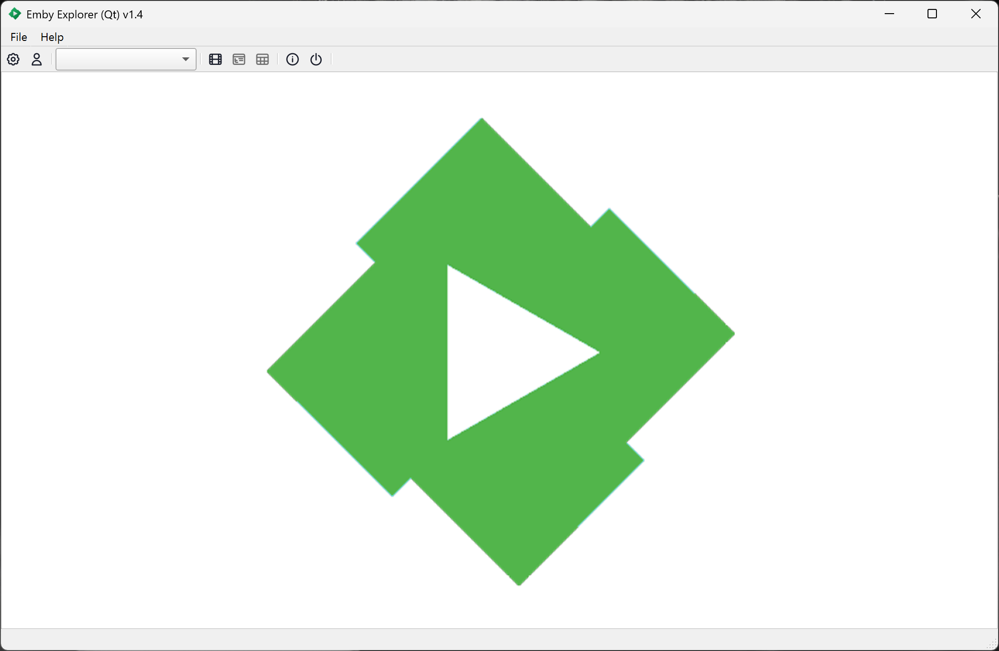
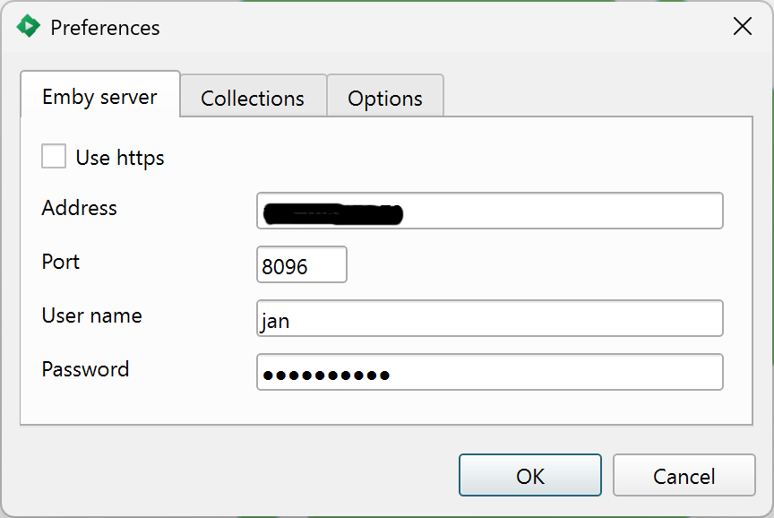
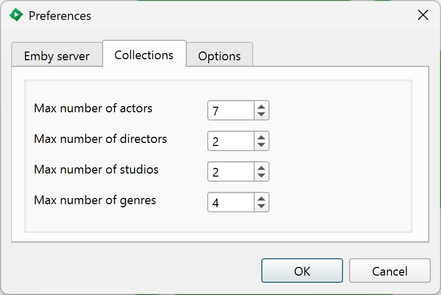
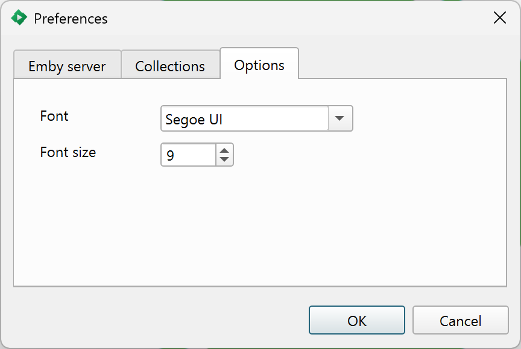
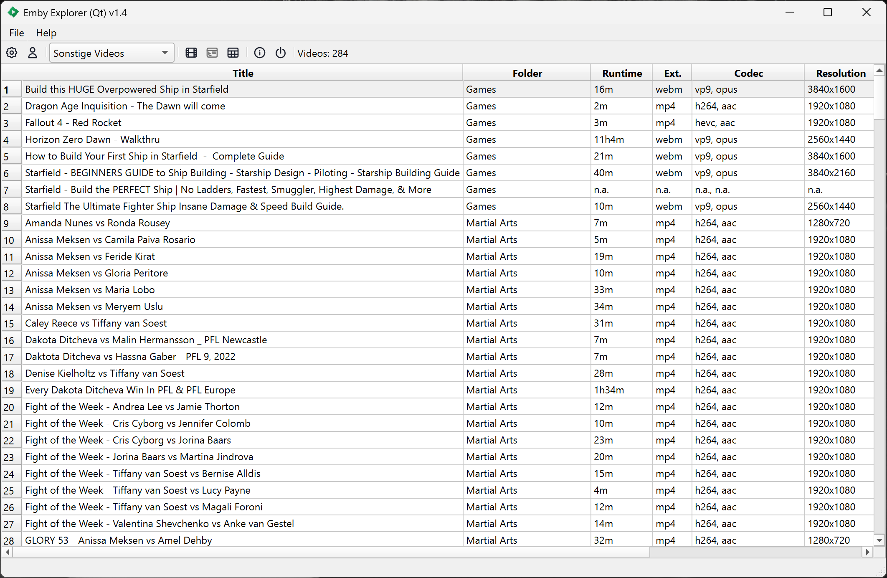
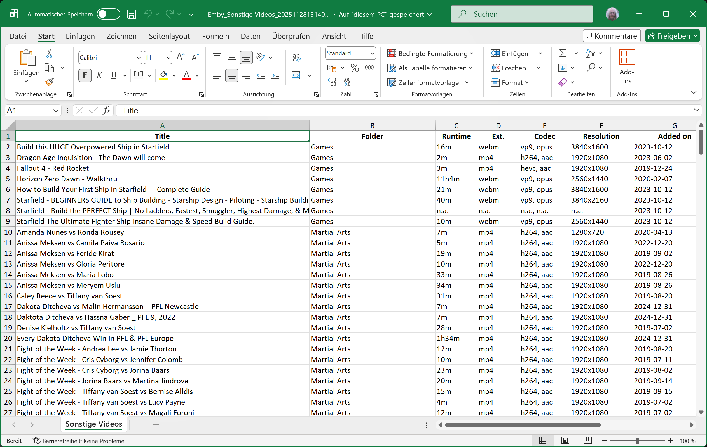

## Emby Explorer (Qt) - (w) 2025 Jan Buchholz 

Emby Explorer (Qt) is a lightweight Qt6 application to explore your Emby media server.
- Browse collections including movies, series, and home videos
- Configure the level of detail to fetch (cast, directors, genres and more)
- View a popup dialog with cover art and summaries for movies and series
- Export media details directly to Excel

### Welcome screen

### Preferences - Configure connection to server

### Preferences - Configure level of detail

### Preferences - Select font and font size

### Fetched *Home videos* collection

### Collection exported to Excel

### Credits
[Daniel Nicoletti (dantti) and Jay Two (j2Doll)](https://github.com/QtExcel/QXlsx) for "QXlsx"

### Known issues
On macOS, the app requires network access permission.  
The first login to the Emby server may fail until access is granted.

### Updates

**2025-09-11**
- Fixed broken ToolBar → ToolButton style on macOS (no hover/click effect)
- Added `.json` extension to preferences file
- Minor enhancements

**2025-10-15**
- All releases now built with Qt 6.10
- Code review completed
- Preferences now use ascii85 format (instead of base64)
- Minor fixes

**2025-11-28 – Release v1.4**
- Added timeout for REST API
- English translation overhaul
- Removed German translation
- This README :)

Have fun.

